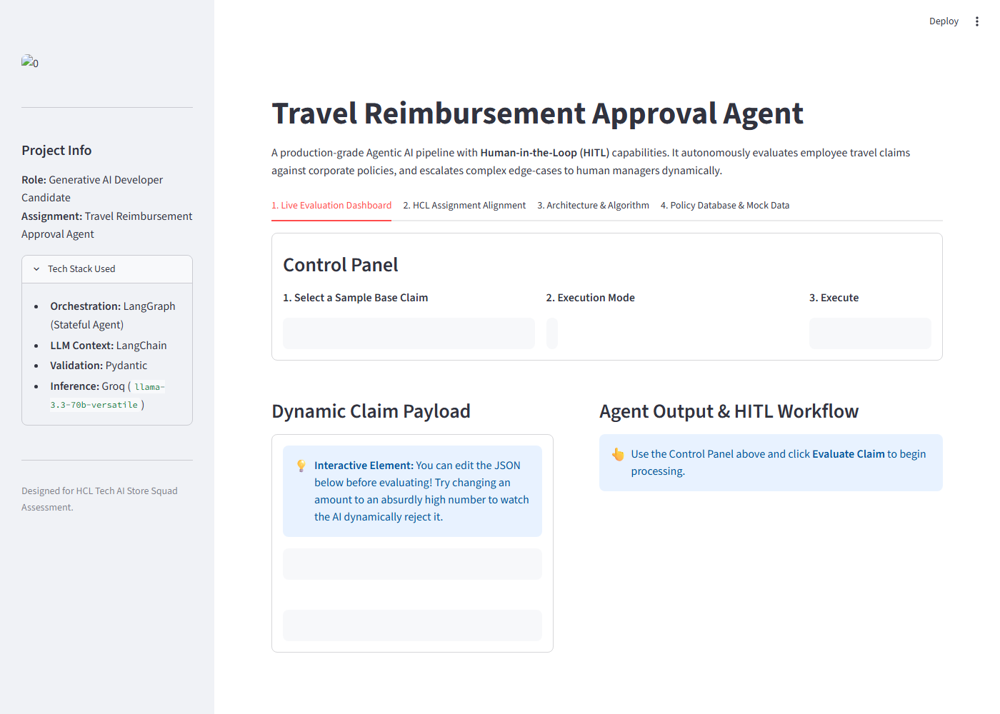
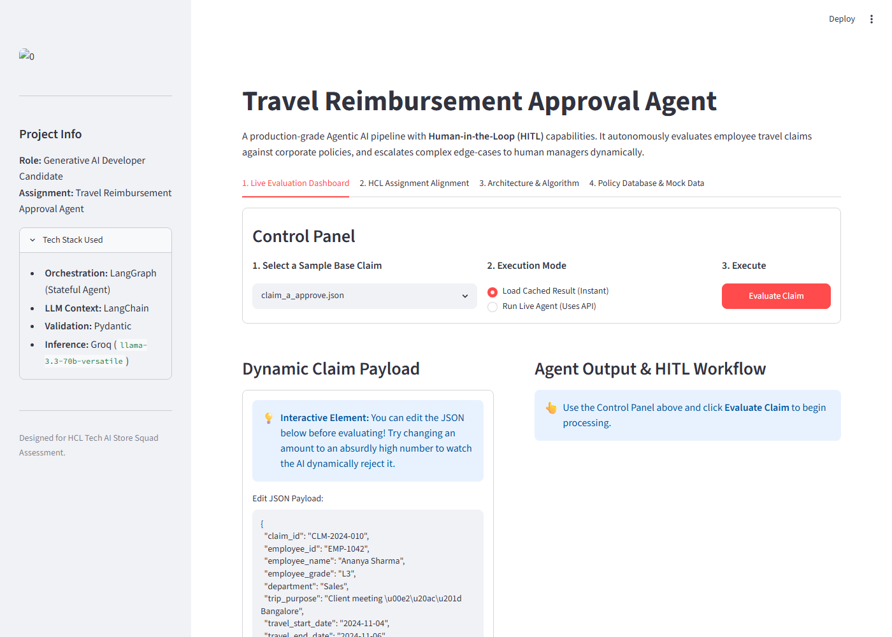
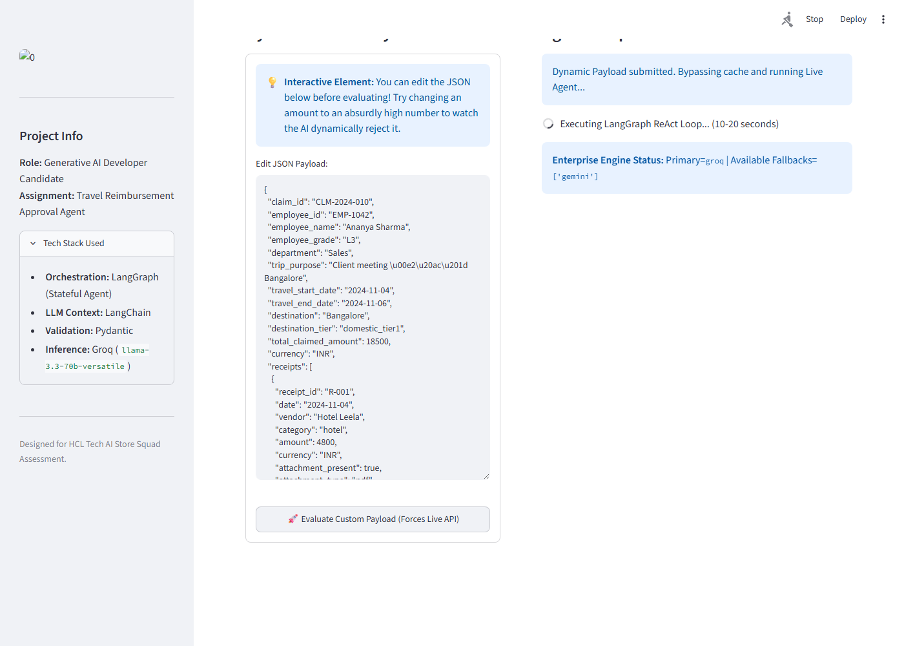

# Travel Reimbursement Approval Agent

## 1. Overview
The Travel Reimbursement Approval Agent is an autonomous, policy-grounded workflow system designed to evaluate employee travel expense claims. By combining LLM-based reasoning (via Groq/OpenAI) with deterministic local tools, the agent evaluates receipt completeness, validates daily per-diem limits, runs duplicate checks, and routes claims for automated approval, rejection, or manual manager review.

### \ud83c\udf1f Standout Features (Optional Enhancements Fulfilled)
- **Interactive Streamlit UI**: Run `streamlit run app.py` for a polished, highly-visual dashboard to test claims interactively during demos.
- **Automated Validation Testing**: Run `pytest test_agent.py` to cryptographically prove that the final deterministic outputs perfectly adhere to all financial math rules (e.g., ensuring Manual Reviews yield `0.0` amounts, and approvals + rejections sum exactly to the `total_claimed_amount`).
- **Audit Trails**: The agent automatically emits a chronologically sequenced log of all tool executions, contextual inputs, and deterministic math auto-corrections.

---

## 2. Architecture

### Backend Engineer Perspective
From a traditional software engineering perspective, the system is designed as a stateful, transaction-safe state machine. A claim intake payload goes through a series of sequential processing steps: schema validation, a deterministic database duplicate check, a dynamic context-gathering phase, an LLM-assisted decision-making phase, and a final rule-based post-validation gateway. If any stage flags the claim for manual review, the transaction is marked for escalation. All audit trails and intermediary logs are accumulated inside a single, mutable transaction context that acts as the single source of truth throughout the execution.

### Agentic State Graph (LangGraph)
The system is orchestrated using a state graph (`langgraph`). The nodes and state transitions flow as follows:

```
[START]
   │
   ▼
[intake_node] (Validates & calculates trip days)
   │
   ▼
[policy_retrieval_node] ──(Duplicate detected?)──► [output_validator_node]
   │ (No duplicate)                                        │
   ▼                                                       ▼
[llm_reasoning_node] ◄──► [tool_node]              [output_node] ──► [END]
   │ (No more tools)                                       ▲
   ▼                                                       │
[synthesizer_node] ────────────────────────────────────────┘
```

#### Graph Nodes:
- **`intake_node`**: Validates the incoming claim payload against the Pydantic `ClaimInput` schema and pre-calculates the `trip_days` duration.
- **`policy_retrieval_node`**: Performs a duplicate check against `processed_claims.json`. If a duplicate `claim_id` is found, it constructs a pre-filled `Rejected` decision and routes directly to the output validator. Otherwise, it retrieves relevant policy guidelines based on the receipt expense categories.
- **`llm_reasoning_node`**: The core execution node. Configured with a system prompt and bound to the agent's tools. It decides which tools to invoke dynamically based on the policy context.
- **`tool_node`**: An execution sandbox that runs the tools selected by the LLM (`policy_lookup`, `receipt_completeness_check`, `per_diem_limit_check`, `approval_threshold_check`) and returns the results to the conversation history.
- **`synthesizer_node`**: Uses structured LLM output mapping to the `ReimbursementDecision` model to construct the final decision, amounts, and written reasoning based on the entire conversation history.
- **`output_validator_node`**: Inspects the final decision payload, validating the mathematical consistency of approved/rejected amounts, checking confidence bounds, and enforcing manual review flags.
- **`output_node`**: Appends the final UTC ISO processing timestamp and exports the state.

---

## 3. Tools
The agent uses 4 modular tools to enforce specific business logic:
1. **`receipt_completeness_check`**: Validates that every receipt object in the claim is structurally complete—checking for the presence of attachments, non-null vendors, non-null dates, and positive amounts. This enforces the policy that un-documented line items cannot be reimbursed.
2. **`per_diem_limit_check`**: Looks up the daily limits for a specific category (e.g., meals, hotel) based on the destination tier. It multiplies the daily limit by the trip days and compares the total allowed limit against the employee's claimed amount, isolating any excess.
3. **`approval_threshold_check`**: Checks the employee grade against the company's financial approval matrix to route the claim (e.g., auto-approve, manager approval required, or director approval required).
4. **`policy_lookup`**: Queries the policy rules matching a specific category and destination tier from the central travel policy database to supply specific rules (like pre-approval limits) directly to the LLM.

---

## 4. Policy Grounding
Policies are stored locally in a structured JSON database (`data/travel_policy.json`). Before the LLM reasoning phase, the `policy_retrieval_node` dynamically inspects the categories in the claim receipts and extracts only the relevant rules. These rules are injected directly into the LLM system prompt. The LLM is instructed to strictly reference rule IDs (e.g., `MEAL-POL-001 §3.2`) in its evaluation reasoning. This ensures the model's logic is fully grounded in company documentation, eliminating hallucination.

---

## 5. Setup

### Prerequisites
- Python 3.10 or higher
- Git

### Installation
1. **Activate Virtual Environment:**
   ```powershell
   # Windows PowerShell
   .\travelvenv\Scripts\activate
   ```
2. **Install Dependencies:**
   ```bash
   pip install -r requirements.txt
   ```
3. **Configure Environment Variables:**
   Create a `.env` file in the root folder using `.env.example` as a template:
   ```env
   OPENAI_API_KEY=
   GROQ_API_KEY=your_groq_api_key_here
   LLM_PROVIDER=groq
   ```

---

## 6. Running the Agent

### Command Line Interface (CLI)
- **Evaluate a single claim:**
  ```bash
  python cli.py --claim data/sample_claims/claim_a_approve.json
  ```
- **Evaluate all claims in batch and export output:**
  ```bash
  python cli.py --all --output outputs/sample_outputs.json
  ```
- **Verbose mode showing step-by-step tool executions:**
  ```bash
  python cli.py --claim data/sample_claims/claim_b_partial.json --verbose
  ```

### Interactive UI (Streamlit) \ud83c\udf1f
For the best demonstration experience, launch the visual dashboard:
```bash
streamlit run app.py
```
*(This allows you to select claims from a dropdown, view the input JSON, and run the evaluation live or load cached deterministic results to bypass LLM rate limits).*

### Automated Verification Tests \ud83c\udf1f
To cryptographically verify the strict mathematical guardrails of the agent:
```bash
pytest test_agent.py
```

### API Server
- **Boot the API server:**
  ```bash
  python api.py
  ```
- **Test health check endpoint:**
  ```bash
  curl http://localhost:8000/health
  ```
- **Evaluate a claim via POST:**
  ```bash
  curl -X POST http://localhost:8000/evaluate-claim \
    -H "Content-Type: application/json" \
    -d @data/sample_claims/claim_a_approve.json
  ```

---

## 7. Sample Outputs

The agent's batch output results for the five sample claims are structured as follows:

| Claim File | Claim ID | Decision | Approved Amount | Rejected Amount | Confidence | Key Reasoning |
| :--- | :--- | :--- | :--- | :--- | :--- | :--- |
| `claim_a_approve.json` | CLM-2024-010 | **Approved** | 18500.0 | 0.0 | 1.0 | The claim is approved as all expenses are within the per-diem limits and have complete receipts. |
| `claim_b_partial.json` | CLM-2024-011 | **Partially Approved** | 30400.0 | 1600.0 | 0.8 | Your claim has been partially approved. |
| `claim_c_reject.json` | CLM-2024-012 | **Rejected** | 0.0 | 22000.0 | 1.0 | The claim has been rejected because mandatory receipt attachments are missing for all expenses. |
| `claim_d_manual.json` | CLM-2024-013 | **Manual Review** | 0.0 | 0.0 | 0.9 | The claim amounts are within per-diem limits, however, the total amount of INR 68000 exceeds the auto-approval threshold for your L2 grade and requires escalation. |
| `claim_e_duplicate.json` | CLM-2024-009 | **Rejected** | 0.0 | 15000.0 | 1.0 | Duplicate claim detected — this claim ID has already been processed |

---

## 8. Design Choices & Trade-offs

- **Why LangGraph over simple chains:** Travel reimbursement is non-linear. The agent needs to retrieve context, call a tool, inspect results, decide whether to query another category limit, and loop back. Simple linear chains (like sequential LangChain pipelines) cannot handle loops and conditional routing dynamically. LangGraph provides first-class support for cyclical ReAct loops and state persistence.
- **Why Pydantic output validation:** LLMs are non-deterministic and can return formatting mistakes, text noise, or minor mathematical errors. Using Pydantic schemas allows us to validate the agent's output structure at runtime. If the output fails math check or formatting, it is caught at the `output_validator` node and automatically escalated to manual review, preventing bad automated decisions.
- **Why mock JSON files over vector DB:** For policy rules and matrices, structured JSON documents represent a highly deterministic, relational database. A vector DB is fantastic for unstructured semantic search but introduces non-determinism (semantic search can return top-k matches that aren't the exact rule). In production, this would be replaced by an enterprise relational database (like PostgreSQL) for per-diem lookups and a hybrid (semantic + keyword metadata) vector store for policy clauses.
- **Why 4 tools:** Rather than writing a single massive tool, splitting business logic into 4 specialized tools (`policy_lookup`, `receipt_completeness_check`, `per_diem_limit_check`, `approval_threshold_check`) allows the agent to call only what is necessary, saving tokens and improving execution accuracy.
- **Audit trail:** In regulated industries, automated decisions must be explainable. Capturing the exact step-by-step tool inputs, outputs, and rule citations allows auditing the agent's logic for compliance, reporting, and disputes.

---

## 9. Assumptions & Limitations
- **Date calculation assumes UTC:** The agent computes trip days using standard Gregorian dates and assumes the travel dates are contiguous. Cross-timezone travel overlaps are not handled.
- **Single currency constraint:** The current iteration assumes all currency transactions are in INR. In a multi-currency environment, foreign exchanges would need dynamic conversion rate tools.
- **Context window limits:** Extremely large claims with hundreds of receipt items could exceed the context window of smaller LLM models or hit API rate limits quickly during batch runs.
- **Deterministic duplicate detection:** The duplicate check matches only the exact `claim_id`. In a real-world scenario, duplicates are often submitted under new IDs, requiring fuzzy matching of dates, merchants, and amounts.

---

## 10. What's Next (Production Roadmap)
1. **Vector Store Integration:** Implement hybrid retrieval (RAG) using a vector store (e.g. pgvector or Qdrant) to search through unstructured policy manuals for edge cases.
2. **Receipt OCR Tooling:** Replace the mock `attachment_present` boolean with a real OCR tool (e.g. Azure Document Intelligence or Tesseract) to parse receipt files and match details against claim input.
3. **Observability and Monitoring:** Integrate LangSmith or Phoenix to trace latency, cost, and rate-limiting limits.
4. **Active Directory & HR Integration:** Connect to the company's employee database API to dynamically fetch employee grades, managers, and reporting structures instead of relying on input payloads.
5. **Persistent Claim Store:** Connect output node to a relational database (PostgreSQL/MySQL) to log processed claims, tracking history and preventing duplicate submissions permanently.

---

## 11. Screenshots

### 1. Main Dashboard


### 2. Cached Engine Execution


### 3. Financial Decision and Reason


### 4. Agent Audit Trail

