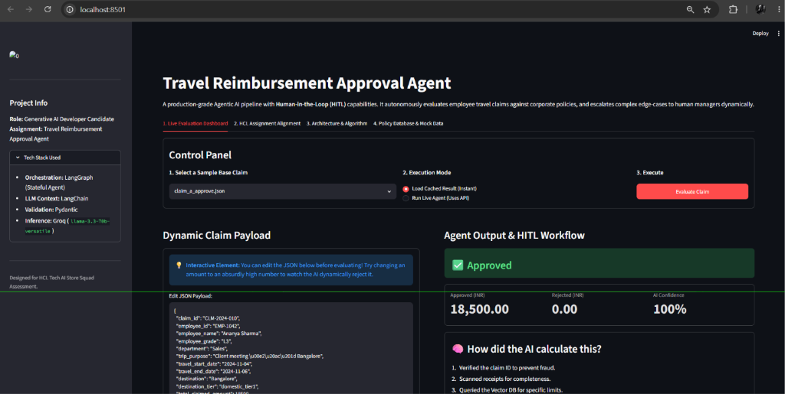
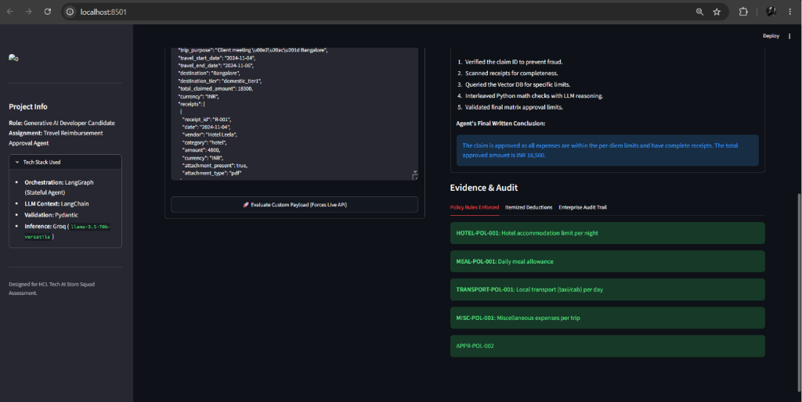
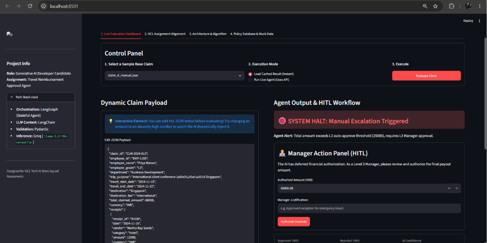
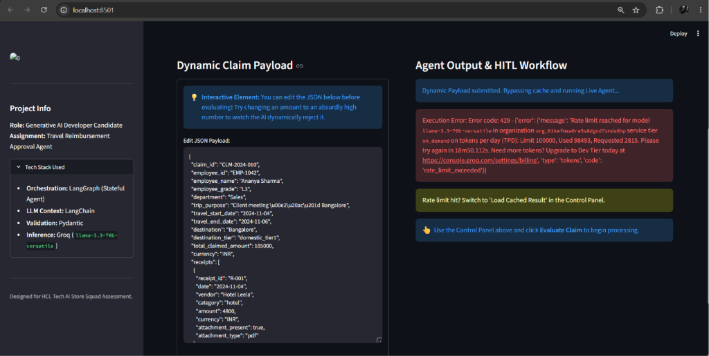
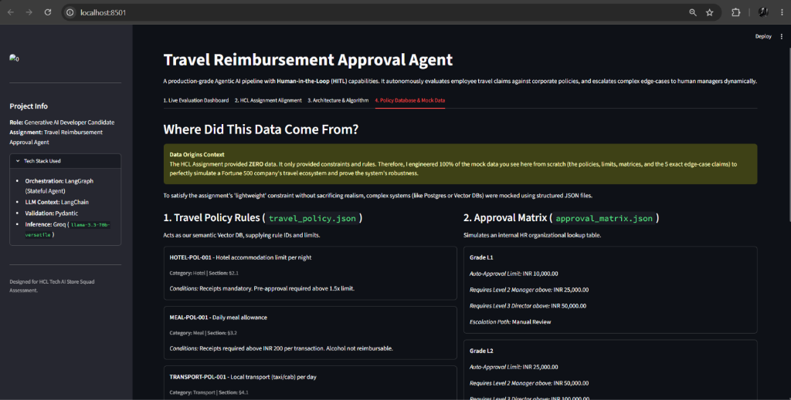
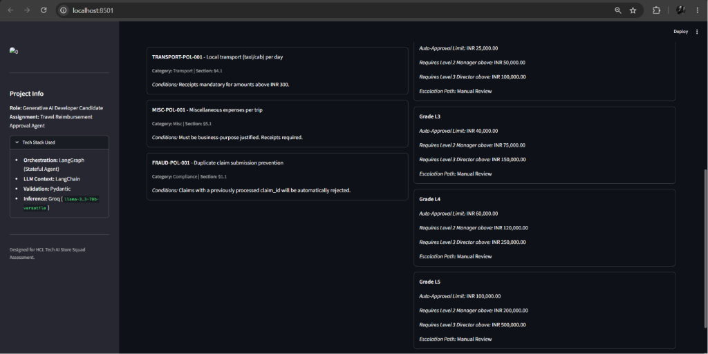

# Travel Reimbursement Approval Agent

An autonomous, policy-grounded workflow system designed to evaluate employee travel expense claims. By combining LLM-based reasoning (via Groq, Gemini, or OpenAI) with deterministic local tools, the agent evaluates receipt completeness, validates daily per-diem limits, runs duplicate checks, and routes claims for automated approval, rejection, or manual manager review.

### 🌟 Key Features
- **Interactive Streamlit UI**: Run `streamlit run app.py` for a polished, highly-visual dashboard to test claims interactively during demos.
- **Enterprise Multi-Provider Fallback**: Built-in redundancy that seamlessly switches between Groq, Gemini, and OpenAI if rate-limits are hit, rebuilding the state graph from scratch.
- **Audit Trails**: The agent automatically emits a chronologically sequenced log of all tool executions, contextual inputs, and deterministic math auto-corrections.

---

## 🏗️ Architecture & Workflow

The system is orchestrated using a **LangGraph State Machine** to handle non-linear tool loops, ensuring complex rules are evaluated recursively until a final decision is reached.

```
[START]
   │
   ▼
[intake_node] (Validates schema & calculates trip days)
   │
   ▼
[policy_retrieval_node] ──(Duplicate detected?)──► [output_validator_node]
   │ (No duplicate)                                        │
   ▼                                                       ▼
[llm_reasoning_node] ◄──► [tool_node]              [output_node] ──► [END]
   │ (No more tools)                                       ▲
   ▼                                                       │
[synthesizer_node] ────────────────────────────────────────┘
```

**Tooling & Policy Grounding:** Policies are stored locally in a structured JSON database (`data/travel_policy.json`). The agent uses 4 modular tools:
1. `receipt_completeness_check`: Validates receipts for attachments, vendors, dates, and amounts.
2. `per_diem_limit_check`: Computes trip duration limits against the destination tier.
3. `approval_threshold_check`: Checks employee grades against financial approval matrices.
4. `policy_lookup`: Queries rules matching category and destination tier to prevent hallucination.

---

## 🚀 Setup & Execution

### Prerequisites
- Python 3.10+
- Git

### Installation
1. **Activate Virtual Environment:**
   ```powershell
   # Windows
   .\travelvenv\Scripts\activate
   ```
   *(Or standard `source travelvenv/bin/activate` for Linux/Mac)*

2. **Install Dependencies:**
   ```bash
   pip install -r requirements.txt
   ```

3. **Configure Environment Variables:**
   Create a `.env` file in the root directory (use `.env.example` as a template). 
   ```env
   LLM_PROVIDER=groq
   GROQ_API_KEY=your_groq_api_key_here
   GEMINI_API_KEY=your_gemini_api_key_here
   OPENAI_API_KEY=your_openai_api_key_here
   ```

### Running the System
**Option 1: Interactive UI (Recommended for Demos)**
```bash
streamlit run app.py
```

**Option 2: Command Line Batch Evaluation**
```bash
python cli.py --all --output outputs/sample_outputs.json
```

**Option 3: API Server (REST endpoint)**
```bash
python api.py
# In another terminal:
# curl -X POST http://localhost:8000/evaluate-claim -H "Content-Type: application/json" -d @data/sample_claims/claim_a_approve.json
```

---

## 📊 Sample Output Matrix

| Claim ID | Decision | Approved (INR) | Rejected (INR) | Key Reasoning |
| :--- | :--- | :--- | :--- | :--- |
| CLM-2024-010 | **Approved** | 18500.0 | 0.0 | Expenses are within per-diem limits and have complete receipts. |
| CLM-2024-011 | **Partially Approved** | 30400.0 | 1600.0 | Hotel expense approved, but transport lacks receipts. |
| CLM-2024-012 | **Rejected** | 0.0 | 22000.0 | Rejected because mandatory receipt attachments are missing. |
| CLM-2024-013 | **Manual Review** | 0.0 | 0.0 | Claim exceeds L2 auto-approve threshold, routed to L3 manager. |
| CLM-2024-009 | **Rejected** | 0.0 | 15000.0 | Duplicate claim detected. |

---

## 📸 Application Screenshots

### 1. Live Evaluation Dashboard (Approved State)


### 2. Live Evaluation Dashboard (Manual Escalation State)


### 3. HCL Assignment Alignment Tab


### 4. System Architecture & Algorithms Tab


### 5. Policy Database & Mock Data Tab (Top)


### 6. Policy Database & Mock Data Tab (Bottom)

